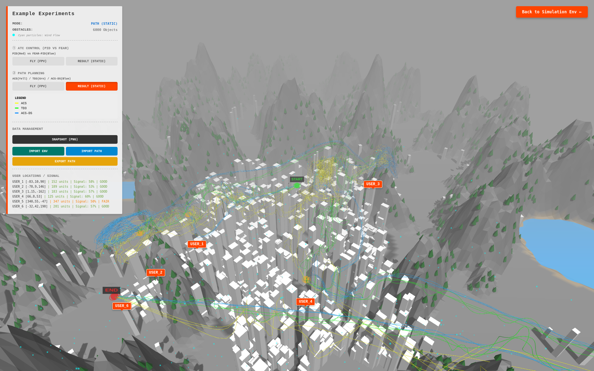
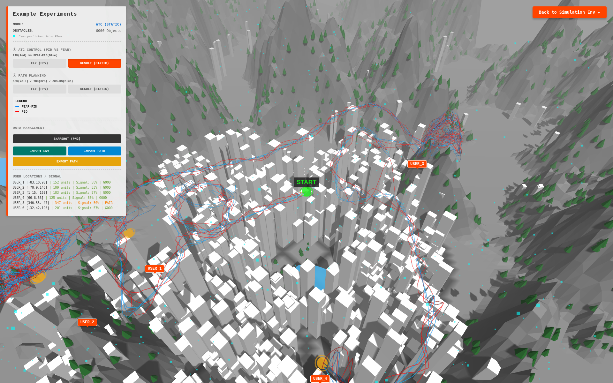

# UAV-Assisted Fog Computing Simulation Demo

   

This demo is an interactive mini demonstration created for the work **"Energy-Aware Holistic Optimization in UAV-Assisted Fog Computing: Attitude, Trajectory, and Task Assignment"**, designed to help quickly understand our simulation environment.

  

  

## Background

This demo is built with **Three.js** and serves as a simplified, interactive version of our complete simulation system implemented in **NVIDIA Isaac Gym (Isaac Sim)**. To facilitate browser-based demonstration and interaction, we have simplified the following aspects:

- **Motion Control**: Uses a simplified FEAR-PID attitude control algorithm
- **Environmental Variables**: Only wind field effects on flight are retained
- **Communication Model**: Simplified signal propagation and occlusion detection
- **Task System**: Simplified task assignment and user interaction

Despite these simplifications, this demo still reflects the core task scenarios and key performance metrics we focus on in the paper.

## Main Features

### Control Modes

- **Simple Mode**: Direct velocity-based control, suitable for quick exploration
- **Control Mode**: Uses simplified FEAR-PID control algorithm, closer to realistic physical behavior

### Environment System

- Procedurally generated terrain (urban and mountainous)
- Environmental elements: buildings, trees, lakes
- Dynamic wind field simulation

### Communication Quality Assessment

- Real-time distance calculation between UAV and 6 user locations
- Signal strength assessment based on distance and obstacles
- Line-of-sight detection (considering building and terrain occlusion)

### Data Management

- Automatic map data save/load
- Support for exporting/importing map data in JSON format
- Reset to generate new random maps

## Usage

### Launch

Simply open `Simulation_Env_Mini_Demo.html` in a browser to run. No installation or dependencies required.

### Basic Operations

#### Control Keys
- **W/S**: Pitch (forward/backward)
- **A/D**: Roll (left/right)
- **↑/↓**: Altitude control (ascend/descend)
- **←/→**: Yaw rotation (turn left/right)

#### Mode Switching
- **Control Mode**: Click "Simple" or "Control" button in the top-left panel to switch
- **Camera View**: Click "ORBIT" (orbital camera) or "FPV" (first-person view) button to switch

### Dashboard Description

The top-left dashboard displays the following information in real-time:

#### Status Information
- **Control Mode**: Current control mode (Simple or FEAR-PID)
- **State**: Current UAV state (STABLE/MOVING/HOVER)
- **Battery**: Battery level in Control mode

#### Flight Data
- **Position**: Current UAV position (X/Z axes: unit length, Y axis: meters)
- **Speed**: Current flight speed
- **Acceleration**: Current acceleration (Simple mode)
- **Attitude**: Pitch/Roll angles (Control mode)

#### Environmental Information
- **Wind Speed**: Current wind speed and direction
- **Collision Status**: Whether collision has occurred

#### Physical Parameters
- Maximum acceleration, maximum speed, maximum altitude, and other limiting parameters
- Motor output (Control mode)

#### User Locations and Communication
- **User Positions**: Coordinates of 6 user locations
- **Distance**: Distance from UAV to each user (unit length)
- **Signal Strength**: Communication signal strength percentage (0-100%)
- **Quality Level**: EXCELLENT / GOOD / FAIR / POOR / NONE

### Other Features

- **Screenshot**: Click "SNAPSHOT (PNG)" to save current view
- **Export Data**: Click "EXPORT DATA" to export map data
- **Import Data**: Click "IMPORT DATA" to import previously saved maps
- **Reset Map**: Click "RESET & NEW MAP" to generate a new random map

## Technical Notes

### Control Algorithm

Control mode uses a simplified **FEAR-PID** control algorithm:
- Cascaded PID structure (attitude angle PID + angular velocity PID)
- Quadrotor X-configuration motor mixing
- Automatic hover and position hold functionality

### Signal Quality Calculation

- **Distance Attenuation Model**: Piecewise attenuation function based on distance
- **Obstacle Detection**: Samples every 2 meters, detecting buildings and terrain along the path
- **Thickness Weighting**: Considers building thickness impact on signal

### Unit Description

- **X/Z Axes**: Unit length (1 unit = 100 meters)
- **Y Axis**: Meters
- **Distance**: Unit length

### Static Visualizations

  

  

## Notes

1. This demo is a simplified version, primarily for demonstration purposes
2. The complete simulation system is implemented in NVIDIA Isaac Gym Sim
3. Map data is saved in browser local storage
4. Modern browsers with WebGL support are recommended for best experience
